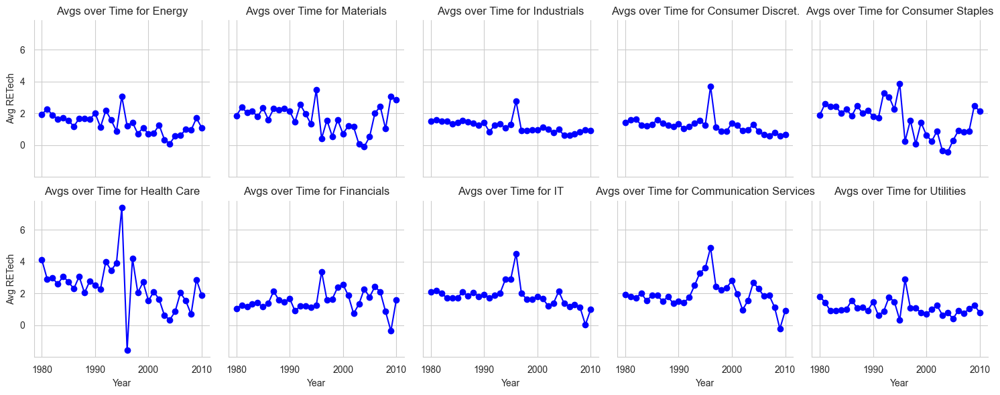
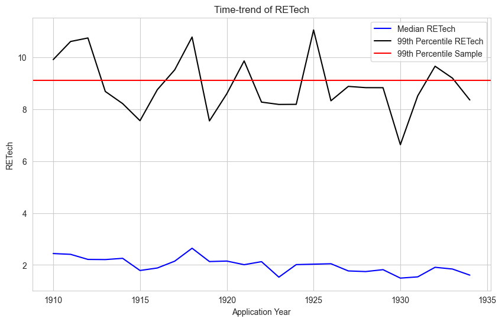

# Assignment 4: Merging

This assignment requires you to 
- Explore some new data on patents
- Implement merges according to [best practices](https://ledatascifi.github.io/ledatascifi-2024/content/03/05b_merging.html#merging-in-new-variables-to-your-analysis)
- I did not include questions explicitly aimed at [Merging in new variables to your analysis](https://ledatascifi.github.io/ledatascifi-2024/content/03/05b_merging.html#merging-in-new-variables-to-your-analysis) or [Create your variables before a merge when possible](https://ledatascifi.github.io/ledatascifi-2024/content/03/05b_merging.html#create-your-variables-before-a-merge-when-possible), but **you should read those** because they will matter for the midterm project and your group projects a lot!
  - I removed questions on these topics to lighten the assignment burden, but don't infer a lack of import: These are very important skills!


```python
import pandas as pd
import numpy as np
import matplotlib.pyplot as plt
import pandas_datareader as pdr
import seaborn as sns

# these three are used to open the CCM dataset:
from io import BytesIO
from zipfile import ZipFile
from urllib.request import urlopen
```

    C:\Users\rzhan\AppData\Local\Temp\ipykernel_15552\944671766.py:1: DeprecationWarning: 
    Pyarrow will become a required dependency of pandas in the next major release of pandas (pandas 3.0),
    (to allow more performant data types, such as the Arrow string type, and better interoperability with other libraries)
    but was not found to be installed on your system.
    If this would cause problems for you,
    please provide us feedback at https://github.com/pandas-dev/pandas/issues/54466
            
      import pandas as pd
    

## Download CCM data

This code comes from the textbook.

To get the URL, I [went to the data repo and found it](https://github.com/LeDataSciFi/data/blob/main/Firm%20Year%20Datasets%20(Compustat)/CCM_cleaned_for_class.zip), and then I right clicked on the "Download" button and copied the link. 


```python
url = 'https://github.com/LeDataSciFi/ledatascifi-2024/blob/main/data/CCM_cleaned_for_class.zip?raw=true'

#ccm = pd.read_stata(url)   
# <-- that code would work if I had uploaded the data as a csv file, but GH said it was too big to upload 
# so I zipped it. We need a little workaround to download it:

with urlopen(url) as request:
    data = BytesIO(request.read())

with ZipFile(data) as archive:
    with archive.open(archive.namelist()[0]) as stata:
        ccm = pd.read_stata(stata)
```

## Firm year patent data.

We will use `firmyear_patstats.csv`. It's in the same place in the data repo as the CCM file. You will figure out how to download it _by script._ Don't download the file to your computer.  

It contains variables that we want to include in the  CCM dataset for analysis.


```python
import requests
from io import StringIO
url = 'https://github.com/LeDataSciFi/data/blob/main/Firm%20Year%20Datasets%20(Compustat)/firmyear_patstats.csv?raw=true'

response = requests.get(url)
if response.status_code == 200:
    content = response.content.decode('utf-8')
    csv_file = StringIO(content)
    firmyear_patstats = pd.read_csv(csv_file)
```

## PART 1

Insert cell(s) below this one as needed to finish this Part.

Load the following two datasets and answer these questions. Assume for these questions that the `ccm` data is the "left" dataset and the `firmyear_patstats` is the "right" dataset. 

1. How many observations are there in `ccm` data?
1. How many observations are there in `firmyear_patstats` data?
4. After an inner merge?
1. How many observations are there after a left merge?
2. After a right merge? 
3. After an outer merge? 
1. Why isn't the answer to Q4 and Q5 the same?
1. Is this a 1:1, 1:M, M:1, or M:M merge?

Remember: Specify `how`, `on`, `indicator=True`, and `validate` on each merge!


```python
ccm
```


<div>
<style scoped>
    .dataframe tbody tr th:only-of-type {
        vertical-align: middle;
    }

    .dataframe tbody tr th {
        vertical-align: top;
    }

    .dataframe thead th {
        text-align: right;
    }
</style>
<table border="1" class="dataframe">
  <thead>
    <tr style="text-align: right;">
      <th></th>
      <th>gvkey</th>
      <th>fyear</th>
      <th>datadate</th>
      <th>lpermno</th>
      <th>gsector</th>
      <th>sic</th>
      <th>sic3</th>
      <th>age</th>
      <th>tic</th>
      <th>state</th>
      <th>...</th>
      <th>tnic3hhi</th>
      <th>tnic3tsimm</th>
      <th>prodmktfluid</th>
      <th>delaycon</th>
      <th>equitydelaycon</th>
      <th>debtdelaycon</th>
      <th>privdelaycon</th>
      <th>l_emp</th>
      <th>l_ppent</th>
      <th>l_laborratio</th>
    </tr>
  </thead>
  <tbody>
    <tr>
      <th>0</th>
      <td>1000</td>
      <td>1975.0</td>
      <td>1975-12-31</td>
      <td>25881.0</td>
      <td></td>
      <td>3089.0</td>
      <td>308.0</td>
      <td>0.0</td>
      <td>AE.2</td>
      <td></td>
      <td>...</td>
      <td>NaN</td>
      <td>NaN</td>
      <td>NaN</td>
      <td>NaN</td>
      <td>NaN</td>
      <td>NaN</td>
      <td>NaN</td>
      <td>0.719789</td>
      <td>2.111788</td>
      <td>1.930200</td>
    </tr>
    <tr>
      <th>1</th>
      <td>1000</td>
      <td>1976.0</td>
      <td>1976-12-31</td>
      <td>25881.0</td>
      <td></td>
      <td>3089.0</td>
      <td>308.0</td>
      <td>1.0</td>
      <td>AE.2</td>
      <td></td>
      <td>...</td>
      <td>NaN</td>
      <td>NaN</td>
      <td>NaN</td>
      <td>NaN</td>
      <td>NaN</td>
      <td>NaN</td>
      <td>NaN</td>
      <td>0.900161</td>
      <td>2.858766</td>
      <td>2.421281</td>
    </tr>
    <tr>
      <th>2</th>
      <td>1000</td>
      <td>1977.0</td>
      <td>1977-12-31</td>
      <td>25881.0</td>
      <td></td>
      <td>3089.0</td>
      <td>308.0</td>
      <td>2.0</td>
      <td>AE.2</td>
      <td></td>
      <td>...</td>
      <td>NaN</td>
      <td>NaN</td>
      <td>NaN</td>
      <td>NaN</td>
      <td>NaN</td>
      <td>NaN</td>
      <td>NaN</td>
      <td>1.008323</td>
      <td>3.040562</td>
      <td>2.437114</td>
    </tr>
    <tr>
      <th>3</th>
      <td>1001</td>
      <td>1983.0</td>
      <td>1983-12-31</td>
      <td>10015.0</td>
      <td>25</td>
      <td>5812.0</td>
      <td>581.0</td>
      <td>0.0</td>
      <td>AMFD.</td>
      <td>OK</td>
      <td>...</td>
      <td>NaN</td>
      <td>NaN</td>
      <td>NaN</td>
      <td>NaN</td>
      <td>NaN</td>
      <td>NaN</td>
      <td>NaN</td>
      <td>0.869618</td>
      <td>2.255074</td>
      <td>1.817871</td>
    </tr>
    <tr>
      <th>4</th>
      <td>1001</td>
      <td>1984.0</td>
      <td>1984-12-31</td>
      <td>10015.0</td>
      <td>25</td>
      <td>5812.0</td>
      <td>581.0</td>
      <td>1.0</td>
      <td>AMFD.</td>
      <td>OK</td>
      <td>...</td>
      <td>NaN</td>
      <td>NaN</td>
      <td>NaN</td>
      <td>NaN</td>
      <td>NaN</td>
      <td>NaN</td>
      <td>NaN</td>
      <td>0.917090</td>
      <td>2.618490</td>
      <td>2.135985</td>
    </tr>
    <tr>
      <th>...</th>
      <td>...</td>
      <td>...</td>
      <td>...</td>
      <td>...</td>
      <td>...</td>
      <td>...</td>
      <td>...</td>
      <td>...</td>
      <td>...</td>
      <td>...</td>
      <td>...</td>
      <td>...</td>
      <td>...</td>
      <td>...</td>
      <td>...</td>
      <td>...</td>
      <td>...</td>
      <td>...</td>
      <td>...</td>
      <td>...</td>
      <td>...</td>
    </tr>
    <tr>
      <th>222996</th>
      <td>297209</td>
      <td>2012.0</td>
      <td>2012-12-31</td>
      <td>13104.0</td>
      <td>10</td>
      <td>1381.0</td>
      <td>138.0</td>
      <td>1.0</td>
      <td>PACD</td>
      <td></td>
      <td>...</td>
      <td>NaN</td>
      <td>NaN</td>
      <td>NaN</td>
      <td>NaN</td>
      <td>NaN</td>
      <td>NaN</td>
      <td>NaN</td>
      <td>0.471877</td>
      <td>8.232553</td>
      <td>8.738124</td>
    </tr>
    <tr>
      <th>222997</th>
      <td>297209</td>
      <td>2013.0</td>
      <td>2013-12-31</td>
      <td>13104.0</td>
      <td>10</td>
      <td>1381.0</td>
      <td>138.0</td>
      <td>2.0</td>
      <td>PACD</td>
      <td></td>
      <td>...</td>
      <td>NaN</td>
      <td>NaN</td>
      <td>NaN</td>
      <td>NaN</td>
      <td>NaN</td>
      <td>NaN</td>
      <td>NaN</td>
      <td>0.663718</td>
      <td>8.414751</td>
      <td>8.474280</td>
    </tr>
    <tr>
      <th>222998</th>
      <td>311524</td>
      <td>2013.0</td>
      <td>2013-12-31</td>
      <td>13861.0</td>
      <td>15</td>
      <td>2860.0</td>
      <td>286.0</td>
      <td>0.0</td>
      <td>TAM</td>
      <td>PA</td>
      <td>...</td>
      <td>0.326118</td>
      <td>1.1371</td>
      <td>5.650078</td>
      <td>NaN</td>
      <td>NaN</td>
      <td>NaN</td>
      <td>NaN</td>
      <td>0.615726</td>
      <td>6.154858</td>
      <td>6.314076</td>
    </tr>
    <tr>
      <th>222999</th>
      <td>315887</td>
      <td>2013.0</td>
      <td>2013-12-31</td>
      <td>14344.0</td>
      <td>20</td>
      <td>4412.0</td>
      <td>441.0</td>
      <td>0.0</td>
      <td>SALT</td>
      <td></td>
      <td>...</td>
      <td>NaN</td>
      <td>NaN</td>
      <td>NaN</td>
      <td>NaN</td>
      <td>NaN</td>
      <td>NaN</td>
      <td>NaN</td>
      <td>0.001000</td>
      <td>5.920753</td>
      <td>12.825821</td>
    </tr>
    <tr>
      <th>223000</th>
      <td>316056</td>
      <td>2013.0</td>
      <td>2013-12-31</td>
      <td>14297.0</td>
      <td>20</td>
      <td>3420.0</td>
      <td>342.0</td>
      <td>0.0</td>
      <td>ALLE</td>
      <td></td>
      <td>...</td>
      <td>0.554508</td>
      <td>1.0259</td>
      <td>1.421064</td>
      <td>NaN</td>
      <td>NaN</td>
      <td>NaN</td>
      <td>NaN</td>
      <td>2.197225</td>
      <td>5.318120</td>
      <td>3.233764</td>
    </tr>
  </tbody>
</table>
<p>223001 rows × 43 columns</p>
</div>


```python
firmyear_patstats
```


<div>
<style scoped>
    .dataframe tbody tr th:only-of-type {
        vertical-align: middle;
    }

    .dataframe tbody tr th {
        vertical-align: top;
    }

    .dataframe thead th {
        text-align: right;
    }
</style>
<table border="1" class="dataframe">
  <thead>
    <tr style="text-align: right;">
      <th></th>
      <th>gvkey</th>
      <th>ayear</th>
      <th>patent_app_count</th>
      <th>RETech_avg</th>
    </tr>
  </thead>
  <tbody>
    <tr>
      <th>0</th>
      <td>1000</td>
      <td>1974</td>
      <td>2</td>
      <td>1.282584</td>
    </tr>
    <tr>
      <th>1</th>
      <td>1000</td>
      <td>1975</td>
      <td>2</td>
      <td>1.309539</td>
    </tr>
    <tr>
      <th>2</th>
      <td>1000</td>
      <td>1976</td>
      <td>2</td>
      <td>1.099830</td>
    </tr>
    <tr>
      <th>3</th>
      <td>1004</td>
      <td>1979</td>
      <td>1</td>
      <td>0.462650</td>
    </tr>
    <tr>
      <th>4</th>
      <td>1004</td>
      <td>1981</td>
      <td>1</td>
      <td>2.276393</td>
    </tr>
    <tr>
      <th>...</th>
      <td>...</td>
      <td>...</td>
      <td>...</td>
      <td>...</td>
    </tr>
    <tr>
      <th>86375</th>
      <td>311524</td>
      <td>2009</td>
      <td>1</td>
      <td>4.002895</td>
    </tr>
    <tr>
      <th>86376</th>
      <td>318728</td>
      <td>2015</td>
      <td>1</td>
      <td>1.407193</td>
    </tr>
    <tr>
      <th>86377</th>
      <td>318728</td>
      <td>2016</td>
      <td>2</td>
      <td>1.995176</td>
    </tr>
    <tr>
      <th>86378</th>
      <td>332115</td>
      <td>2000</td>
      <td>1</td>
      <td>1.765147</td>
    </tr>
    <tr>
      <th>86379</th>
      <td>349530</td>
      <td>2017</td>
      <td>1</td>
      <td>0.521259</td>
    </tr>
  </tbody>
</table>
<p>86380 rows × 4 columns</p>
</div>


```python
#Q1
ccm_obs = ccm.shape[0]
print("CCM number of observations:", ccm_obs)

#Q2
pat_obs = firmyear_patstats.shape[0]
print("Firmyear_patstats number of observations:", pat_obs)

#Q3
firmyear_patstats.columns = ['gvkey', 'fyear', 'patent_app_count', 'RETech_avg']

inner_df = pd.merge(ccm,firmyear_patstats,how='inner', on = ['gvkey', 'fyear'], validate = '1:1', indicator = True)
display(inner_df)
inner_obs = inner_df.shape[0]
print("Inner merge number of obs:", inner_obs)

#Q4
left_df = pd.merge(ccm,firmyear_patstats,how='left', on = ['gvkey', 'fyear'], validate = '1:1', indicator = True)
display(left_df)
left_obs = left_df.shape[0]
print("Left merge number of obs:", left_obs)

#Q5
right_df = pd.merge(ccm,firmyear_patstats,how='right', on = ['gvkey', 'fyear'], validate = '1:1', indicator = True)
display(right_df)
right_obs = right_df.shape[0]
print("Right merge number of obs:", right_obs)

#Q6: After an outer merge?
outer_df = pd.merge(ccm,firmyear_patstats,how='outer', on = ['gvkey', 'fyear'], validate = '1:1', indicator = True)
display(outer_df)
outer_obs = outer_df.shape[0]
print("Outer merge number of obs:", outer_obs)

#Q7: Why isn't the answer to Q4 and Q5 the same?
# There are likely unmatched rows in one of the dfs

#Q8: Is this a 1:1, 1:M, M:1, or M:M merge?
#1:1 Merge
```

    CCM number of observations: 223001
    Firmyear_patstats number of observations: 86380
    


<div>
<style scoped>
    .dataframe tbody tr th:only-of-type {
        vertical-align: middle;
    }

    .dataframe tbody tr th {
        vertical-align: top;
    }

    .dataframe thead th {
        text-align: right;
    }
</style>
<table border="1" class="dataframe">
  <thead>
    <tr style="text-align: right;">
      <th></th>
      <th>gvkey</th>
      <th>fyear</th>
      <th>datadate</th>
      <th>lpermno</th>
      <th>gsector</th>
      <th>sic</th>
      <th>sic3</th>
      <th>age</th>
      <th>tic</th>
      <th>state</th>
      <th>...</th>
      <th>delaycon</th>
      <th>equitydelaycon</th>
      <th>debtdelaycon</th>
      <th>privdelaycon</th>
      <th>l_emp</th>
      <th>l_ppent</th>
      <th>l_laborratio</th>
      <th>patent_app_count</th>
      <th>RETech_avg</th>
      <th>_merge</th>
    </tr>
  </thead>
  <tbody>
    <tr>
      <th>0</th>
      <td>1000</td>
      <td>1975.0</td>
      <td>1975-12-31</td>
      <td>25881.0</td>
      <td></td>
      <td>3089.0</td>
      <td>308.0</td>
      <td>0.0</td>
      <td>AE.2</td>
      <td></td>
      <td>...</td>
      <td>NaN</td>
      <td>NaN</td>
      <td>NaN</td>
      <td>NaN</td>
      <td>0.719789</td>
      <td>2.111788</td>
      <td>1.930200</td>
      <td>2</td>
      <td>1.309539</td>
      <td>both</td>
    </tr>
    <tr>
      <th>1</th>
      <td>1000</td>
      <td>1976.0</td>
      <td>1976-12-31</td>
      <td>25881.0</td>
      <td></td>
      <td>3089.0</td>
      <td>308.0</td>
      <td>1.0</td>
      <td>AE.2</td>
      <td></td>
      <td>...</td>
      <td>NaN</td>
      <td>NaN</td>
      <td>NaN</td>
      <td>NaN</td>
      <td>0.900161</td>
      <td>2.858766</td>
      <td>2.421281</td>
      <td>2</td>
      <td>1.099830</td>
      <td>both</td>
    </tr>
    <tr>
      <th>2</th>
      <td>1004</td>
      <td>1979.0</td>
      <td>1980-05-31</td>
      <td>54594.0</td>
      <td>20</td>
      <td>5080.0</td>
      <td>508.0</td>
      <td>4.0</td>
      <td>AIR</td>
      <td>IL</td>
      <td>...</td>
      <td>NaN</td>
      <td>NaN</td>
      <td>NaN</td>
      <td>NaN</td>
      <td>0.639746</td>
      <td>2.677454</td>
      <td>2.716054</td>
      <td>1</td>
      <td>0.462650</td>
      <td>both</td>
    </tr>
    <tr>
      <th>3</th>
      <td>1004</td>
      <td>1981.0</td>
      <td>1982-05-31</td>
      <td>54594.0</td>
      <td>20</td>
      <td>5080.0</td>
      <td>508.0</td>
      <td>6.0</td>
      <td>AIR</td>
      <td>IL</td>
      <td>...</td>
      <td>NaN</td>
      <td>NaN</td>
      <td>NaN</td>
      <td>NaN</td>
      <td>0.900161</td>
      <td>3.512470</td>
      <td>3.103757</td>
      <td>1</td>
      <td>2.276393</td>
      <td>both</td>
    </tr>
    <tr>
      <th>4</th>
      <td>1004</td>
      <td>1982.0</td>
      <td>1983-05-31</td>
      <td>54594.0</td>
      <td>20</td>
      <td>5080.0</td>
      <td>508.0</td>
      <td>7.0</td>
      <td>AIR</td>
      <td>IL</td>
      <td>...</td>
      <td>NaN</td>
      <td>NaN</td>
      <td>NaN</td>
      <td>NaN</td>
      <td>0.841567</td>
      <td>3.494870</td>
      <td>3.186415</td>
      <td>1</td>
      <td>-0.265829</td>
      <td>both</td>
    </tr>
    <tr>
      <th>...</th>
      <td>...</td>
      <td>...</td>
      <td>...</td>
      <td>...</td>
      <td>...</td>
      <td>...</td>
      <td>...</td>
      <td>...</td>
      <td>...</td>
      <td>...</td>
      <td>...</td>
      <td>...</td>
      <td>...</td>
      <td>...</td>
      <td>...</td>
      <td>...</td>
      <td>...</td>
      <td>...</td>
      <td>...</td>
      <td>...</td>
      <td>...</td>
    </tr>
    <tr>
      <th>49125</th>
      <td>287882</td>
      <td>2011.0</td>
      <td>2011-12-31</td>
      <td>92793.0</td>
      <td>10</td>
      <td>2911.0</td>
      <td>291.0</td>
      <td>3.0</td>
      <td>EC</td>
      <td></td>
      <td>...</td>
      <td>NaN</td>
      <td>NaN</td>
      <td>NaN</td>
      <td>NaN</td>
      <td>2.275111</td>
      <td>10.067163</td>
      <td>7.900469</td>
      <td>1</td>
      <td>2.070726</td>
      <td>both</td>
    </tr>
    <tr>
      <th>49126</th>
      <td>289735</td>
      <td>2013.0</td>
      <td>2013-12-31</td>
      <td>14060.0</td>
      <td>45</td>
      <td>4899.0</td>
      <td>489.0</td>
      <td>0.0</td>
      <td>XGTI</td>
      <td>FL</td>
      <td>...</td>
      <td>NaN</td>
      <td>NaN</td>
      <td>NaN</td>
      <td>NaN</td>
      <td>0.079735</td>
      <td>0.591114</td>
      <td>2.273243</td>
      <td>4</td>
      <td>0.706199</td>
      <td>both</td>
    </tr>
    <tr>
      <th>49127</th>
      <td>293754</td>
      <td>2011.0</td>
      <td>2011-12-31</td>
      <td>12667.0</td>
      <td>35</td>
      <td>2836.0</td>
      <td>283.0</td>
      <td>0.0</td>
      <td>MDGN</td>
      <td>PA</td>
      <td>...</td>
      <td>-0.050327</td>
      <td>0.165006</td>
      <td>-0.039408</td>
      <td>0.175057</td>
      <td>0.030529</td>
      <td>0.360468</td>
      <td>2.639057</td>
      <td>1</td>
      <td>0.515078</td>
      <td>both</td>
    </tr>
    <tr>
      <th>49128</th>
      <td>295786</td>
      <td>2013.0</td>
      <td>2013-12-31</td>
      <td>14144.0</td>
      <td>20</td>
      <td>3523.0</td>
      <td>352.0</td>
      <td>0.0</td>
      <td>CNHI</td>
      <td></td>
      <td>...</td>
      <td>NaN</td>
      <td>NaN</td>
      <td>NaN</td>
      <td>NaN</td>
      <td>4.279329</td>
      <td>9.005774</td>
      <td>4.740270</td>
      <td>179</td>
      <td>0.711167</td>
      <td>both</td>
    </tr>
    <tr>
      <th>49129</th>
      <td>296885</td>
      <td>2012.0</td>
      <td>2012-12-31</td>
      <td>13707.0</td>
      <td>35</td>
      <td>2836.0</td>
      <td>283.0</td>
      <td>0.0</td>
      <td>RDHL</td>
      <td></td>
      <td>...</td>
      <td>NaN</td>
      <td>NaN</td>
      <td>NaN</td>
      <td>NaN</td>
      <td>NaN</td>
      <td>0.107059</td>
      <td>NaN</td>
      <td>2</td>
      <td>1.608207</td>
      <td>both</td>
    </tr>
  </tbody>
</table>
<p>49130 rows × 46 columns</p>
</div>


    Inner merge number of obs: 49130
    


<div>
<style scoped>
    .dataframe tbody tr th:only-of-type {
        vertical-align: middle;
    }

    .dataframe tbody tr th {
        vertical-align: top;
    }

    .dataframe thead th {
        text-align: right;
    }
</style>
<table border="1" class="dataframe">
  <thead>
    <tr style="text-align: right;">
      <th></th>
      <th>gvkey</th>
      <th>fyear</th>
      <th>datadate</th>
      <th>lpermno</th>
      <th>gsector</th>
      <th>sic</th>
      <th>sic3</th>
      <th>age</th>
      <th>tic</th>
      <th>state</th>
      <th>...</th>
      <th>delaycon</th>
      <th>equitydelaycon</th>
      <th>debtdelaycon</th>
      <th>privdelaycon</th>
      <th>l_emp</th>
      <th>l_ppent</th>
      <th>l_laborratio</th>
      <th>patent_app_count</th>
      <th>RETech_avg</th>
      <th>_merge</th>
    </tr>
  </thead>
  <tbody>
    <tr>
      <th>0</th>
      <td>1000</td>
      <td>1975.0</td>
      <td>1975-12-31</td>
      <td>25881.0</td>
      <td></td>
      <td>3089.0</td>
      <td>308.0</td>
      <td>0.0</td>
      <td>AE.2</td>
      <td></td>
      <td>...</td>
      <td>NaN</td>
      <td>NaN</td>
      <td>NaN</td>
      <td>NaN</td>
      <td>0.719789</td>
      <td>2.111788</td>
      <td>1.930200</td>
      <td>2.0</td>
      <td>1.309539</td>
      <td>both</td>
    </tr>
    <tr>
      <th>1</th>
      <td>1000</td>
      <td>1976.0</td>
      <td>1976-12-31</td>
      <td>25881.0</td>
      <td></td>
      <td>3089.0</td>
      <td>308.0</td>
      <td>1.0</td>
      <td>AE.2</td>
      <td></td>
      <td>...</td>
      <td>NaN</td>
      <td>NaN</td>
      <td>NaN</td>
      <td>NaN</td>
      <td>0.900161</td>
      <td>2.858766</td>
      <td>2.421281</td>
      <td>2.0</td>
      <td>1.099830</td>
      <td>both</td>
    </tr>
    <tr>
      <th>2</th>
      <td>1000</td>
      <td>1977.0</td>
      <td>1977-12-31</td>
      <td>25881.0</td>
      <td></td>
      <td>3089.0</td>
      <td>308.0</td>
      <td>2.0</td>
      <td>AE.2</td>
      <td></td>
      <td>...</td>
      <td>NaN</td>
      <td>NaN</td>
      <td>NaN</td>
      <td>NaN</td>
      <td>1.008323</td>
      <td>3.040562</td>
      <td>2.437114</td>
      <td>NaN</td>
      <td>NaN</td>
      <td>left_only</td>
    </tr>
    <tr>
      <th>3</th>
      <td>1001</td>
      <td>1983.0</td>
      <td>1983-12-31</td>
      <td>10015.0</td>
      <td>25</td>
      <td>5812.0</td>
      <td>581.0</td>
      <td>0.0</td>
      <td>AMFD.</td>
      <td>OK</td>
      <td>...</td>
      <td>NaN</td>
      <td>NaN</td>
      <td>NaN</td>
      <td>NaN</td>
      <td>0.869618</td>
      <td>2.255074</td>
      <td>1.817871</td>
      <td>NaN</td>
      <td>NaN</td>
      <td>left_only</td>
    </tr>
    <tr>
      <th>4</th>
      <td>1001</td>
      <td>1984.0</td>
      <td>1984-12-31</td>
      <td>10015.0</td>
      <td>25</td>
      <td>5812.0</td>
      <td>581.0</td>
      <td>1.0</td>
      <td>AMFD.</td>
      <td>OK</td>
      <td>...</td>
      <td>NaN</td>
      <td>NaN</td>
      <td>NaN</td>
      <td>NaN</td>
      <td>0.917090</td>
      <td>2.618490</td>
      <td>2.135985</td>
      <td>NaN</td>
      <td>NaN</td>
      <td>left_only</td>
    </tr>
    <tr>
      <th>...</th>
      <td>...</td>
      <td>...</td>
      <td>...</td>
      <td>...</td>
      <td>...</td>
      <td>...</td>
      <td>...</td>
      <td>...</td>
      <td>...</td>
      <td>...</td>
      <td>...</td>
      <td>...</td>
      <td>...</td>
      <td>...</td>
      <td>...</td>
      <td>...</td>
      <td>...</td>
      <td>...</td>
      <td>...</td>
      <td>...</td>
      <td>...</td>
    </tr>
    <tr>
      <th>222996</th>
      <td>297209</td>
      <td>2012.0</td>
      <td>2012-12-31</td>
      <td>13104.0</td>
      <td>10</td>
      <td>1381.0</td>
      <td>138.0</td>
      <td>1.0</td>
      <td>PACD</td>
      <td></td>
      <td>...</td>
      <td>NaN</td>
      <td>NaN</td>
      <td>NaN</td>
      <td>NaN</td>
      <td>0.471877</td>
      <td>8.232553</td>
      <td>8.738124</td>
      <td>NaN</td>
      <td>NaN</td>
      <td>left_only</td>
    </tr>
    <tr>
      <th>222997</th>
      <td>297209</td>
      <td>2013.0</td>
      <td>2013-12-31</td>
      <td>13104.0</td>
      <td>10</td>
      <td>1381.0</td>
      <td>138.0</td>
      <td>2.0</td>
      <td>PACD</td>
      <td></td>
      <td>...</td>
      <td>NaN</td>
      <td>NaN</td>
      <td>NaN</td>
      <td>NaN</td>
      <td>0.663718</td>
      <td>8.414751</td>
      <td>8.474280</td>
      <td>NaN</td>
      <td>NaN</td>
      <td>left_only</td>
    </tr>
    <tr>
      <th>222998</th>
      <td>311524</td>
      <td>2013.0</td>
      <td>2013-12-31</td>
      <td>13861.0</td>
      <td>15</td>
      <td>2860.0</td>
      <td>286.0</td>
      <td>0.0</td>
      <td>TAM</td>
      <td>PA</td>
      <td>...</td>
      <td>NaN</td>
      <td>NaN</td>
      <td>NaN</td>
      <td>NaN</td>
      <td>0.615726</td>
      <td>6.154858</td>
      <td>6.314076</td>
      <td>NaN</td>
      <td>NaN</td>
      <td>left_only</td>
    </tr>
    <tr>
      <th>222999</th>
      <td>315887</td>
      <td>2013.0</td>
      <td>2013-12-31</td>
      <td>14344.0</td>
      <td>20</td>
      <td>4412.0</td>
      <td>441.0</td>
      <td>0.0</td>
      <td>SALT</td>
      <td></td>
      <td>...</td>
      <td>NaN</td>
      <td>NaN</td>
      <td>NaN</td>
      <td>NaN</td>
      <td>0.001000</td>
      <td>5.920753</td>
      <td>12.825821</td>
      <td>NaN</td>
      <td>NaN</td>
      <td>left_only</td>
    </tr>
    <tr>
      <th>223000</th>
      <td>316056</td>
      <td>2013.0</td>
      <td>2013-12-31</td>
      <td>14297.0</td>
      <td>20</td>
      <td>3420.0</td>
      <td>342.0</td>
      <td>0.0</td>
      <td>ALLE</td>
      <td></td>
      <td>...</td>
      <td>NaN</td>
      <td>NaN</td>
      <td>NaN</td>
      <td>NaN</td>
      <td>2.197225</td>
      <td>5.318120</td>
      <td>3.233764</td>
      <td>NaN</td>
      <td>NaN</td>
      <td>left_only</td>
    </tr>
  </tbody>
</table>
<p>223001 rows × 46 columns</p>
</div>


    Left merge number of obs: 223001
    


<div>
<style scoped>
    .dataframe tbody tr th:only-of-type {
        vertical-align: middle;
    }

    .dataframe tbody tr th {
        vertical-align: top;
    }

    .dataframe thead th {
        text-align: right;
    }
</style>
<table border="1" class="dataframe">
  <thead>
    <tr style="text-align: right;">
      <th></th>
      <th>gvkey</th>
      <th>fyear</th>
      <th>datadate</th>
      <th>lpermno</th>
      <th>gsector</th>
      <th>sic</th>
      <th>sic3</th>
      <th>age</th>
      <th>tic</th>
      <th>state</th>
      <th>...</th>
      <th>delaycon</th>
      <th>equitydelaycon</th>
      <th>debtdelaycon</th>
      <th>privdelaycon</th>
      <th>l_emp</th>
      <th>l_ppent</th>
      <th>l_laborratio</th>
      <th>patent_app_count</th>
      <th>RETech_avg</th>
      <th>_merge</th>
    </tr>
  </thead>
  <tbody>
    <tr>
      <th>0</th>
      <td>1000</td>
      <td>1974.0</td>
      <td>NaT</td>
      <td>NaN</td>
      <td>NaN</td>
      <td>NaN</td>
      <td>NaN</td>
      <td>NaN</td>
      <td>NaN</td>
      <td>NaN</td>
      <td>...</td>
      <td>NaN</td>
      <td>NaN</td>
      <td>NaN</td>
      <td>NaN</td>
      <td>NaN</td>
      <td>NaN</td>
      <td>NaN</td>
      <td>2</td>
      <td>1.282584</td>
      <td>right_only</td>
    </tr>
    <tr>
      <th>1</th>
      <td>1000</td>
      <td>1975.0</td>
      <td>1975-12-31</td>
      <td>25881.0</td>
      <td></td>
      <td>3089.0</td>
      <td>308.0</td>
      <td>0.0</td>
      <td>AE.2</td>
      <td></td>
      <td>...</td>
      <td>NaN</td>
      <td>NaN</td>
      <td>NaN</td>
      <td>NaN</td>
      <td>0.719789</td>
      <td>2.111788</td>
      <td>1.930200</td>
      <td>2</td>
      <td>1.309539</td>
      <td>both</td>
    </tr>
    <tr>
      <th>2</th>
      <td>1000</td>
      <td>1976.0</td>
      <td>1976-12-31</td>
      <td>25881.0</td>
      <td></td>
      <td>3089.0</td>
      <td>308.0</td>
      <td>1.0</td>
      <td>AE.2</td>
      <td></td>
      <td>...</td>
      <td>NaN</td>
      <td>NaN</td>
      <td>NaN</td>
      <td>NaN</td>
      <td>0.900161</td>
      <td>2.858766</td>
      <td>2.421281</td>
      <td>2</td>
      <td>1.099830</td>
      <td>both</td>
    </tr>
    <tr>
      <th>3</th>
      <td>1004</td>
      <td>1979.0</td>
      <td>1980-05-31</td>
      <td>54594.0</td>
      <td>20</td>
      <td>5080.0</td>
      <td>508.0</td>
      <td>4.0</td>
      <td>AIR</td>
      <td>IL</td>
      <td>...</td>
      <td>NaN</td>
      <td>NaN</td>
      <td>NaN</td>
      <td>NaN</td>
      <td>0.639746</td>
      <td>2.677454</td>
      <td>2.716054</td>
      <td>1</td>
      <td>0.462650</td>
      <td>both</td>
    </tr>
    <tr>
      <th>4</th>
      <td>1004</td>
      <td>1981.0</td>
      <td>1982-05-31</td>
      <td>54594.0</td>
      <td>20</td>
      <td>5080.0</td>
      <td>508.0</td>
      <td>6.0</td>
      <td>AIR</td>
      <td>IL</td>
      <td>...</td>
      <td>NaN</td>
      <td>NaN</td>
      <td>NaN</td>
      <td>NaN</td>
      <td>0.900161</td>
      <td>3.512470</td>
      <td>3.103757</td>
      <td>1</td>
      <td>2.276393</td>
      <td>both</td>
    </tr>
    <tr>
      <th>...</th>
      <td>...</td>
      <td>...</td>
      <td>...</td>
      <td>...</td>
      <td>...</td>
      <td>...</td>
      <td>...</td>
      <td>...</td>
      <td>...</td>
      <td>...</td>
      <td>...</td>
      <td>...</td>
      <td>...</td>
      <td>...</td>
      <td>...</td>
      <td>...</td>
      <td>...</td>
      <td>...</td>
      <td>...</td>
      <td>...</td>
      <td>...</td>
    </tr>
    <tr>
      <th>86375</th>
      <td>311524</td>
      <td>2009.0</td>
      <td>NaT</td>
      <td>NaN</td>
      <td>NaN</td>
      <td>NaN</td>
      <td>NaN</td>
      <td>NaN</td>
      <td>NaN</td>
      <td>NaN</td>
      <td>...</td>
      <td>NaN</td>
      <td>NaN</td>
      <td>NaN</td>
      <td>NaN</td>
      <td>NaN</td>
      <td>NaN</td>
      <td>NaN</td>
      <td>1</td>
      <td>4.002895</td>
      <td>right_only</td>
    </tr>
    <tr>
      <th>86376</th>
      <td>318728</td>
      <td>2015.0</td>
      <td>NaT</td>
      <td>NaN</td>
      <td>NaN</td>
      <td>NaN</td>
      <td>NaN</td>
      <td>NaN</td>
      <td>NaN</td>
      <td>NaN</td>
      <td>...</td>
      <td>NaN</td>
      <td>NaN</td>
      <td>NaN</td>
      <td>NaN</td>
      <td>NaN</td>
      <td>NaN</td>
      <td>NaN</td>
      <td>1</td>
      <td>1.407193</td>
      <td>right_only</td>
    </tr>
    <tr>
      <th>86377</th>
      <td>318728</td>
      <td>2016.0</td>
      <td>NaT</td>
      <td>NaN</td>
      <td>NaN</td>
      <td>NaN</td>
      <td>NaN</td>
      <td>NaN</td>
      <td>NaN</td>
      <td>NaN</td>
      <td>...</td>
      <td>NaN</td>
      <td>NaN</td>
      <td>NaN</td>
      <td>NaN</td>
      <td>NaN</td>
      <td>NaN</td>
      <td>NaN</td>
      <td>2</td>
      <td>1.995176</td>
      <td>right_only</td>
    </tr>
    <tr>
      <th>86378</th>
      <td>332115</td>
      <td>2000.0</td>
      <td>NaT</td>
      <td>NaN</td>
      <td>NaN</td>
      <td>NaN</td>
      <td>NaN</td>
      <td>NaN</td>
      <td>NaN</td>
      <td>NaN</td>
      <td>...</td>
      <td>NaN</td>
      <td>NaN</td>
      <td>NaN</td>
      <td>NaN</td>
      <td>NaN</td>
      <td>NaN</td>
      <td>NaN</td>
      <td>1</td>
      <td>1.765147</td>
      <td>right_only</td>
    </tr>
    <tr>
      <th>86379</th>
      <td>349530</td>
      <td>2017.0</td>
      <td>NaT</td>
      <td>NaN</td>
      <td>NaN</td>
      <td>NaN</td>
      <td>NaN</td>
      <td>NaN</td>
      <td>NaN</td>
      <td>NaN</td>
      <td>...</td>
      <td>NaN</td>
      <td>NaN</td>
      <td>NaN</td>
      <td>NaN</td>
      <td>NaN</td>
      <td>NaN</td>
      <td>NaN</td>
      <td>1</td>
      <td>0.521259</td>
      <td>right_only</td>
    </tr>
  </tbody>
</table>
<p>86380 rows × 46 columns</p>
</div>


    Right merge number of obs: 86380
    


<div>
<style scoped>
    .dataframe tbody tr th:only-of-type {
        vertical-align: middle;
    }

    .dataframe tbody tr th {
        vertical-align: top;
    }

    .dataframe thead th {
        text-align: right;
    }
</style>
<table border="1" class="dataframe">
  <thead>
    <tr style="text-align: right;">
      <th></th>
      <th>gvkey</th>
      <th>fyear</th>
      <th>datadate</th>
      <th>lpermno</th>
      <th>gsector</th>
      <th>sic</th>
      <th>sic3</th>
      <th>age</th>
      <th>tic</th>
      <th>state</th>
      <th>...</th>
      <th>delaycon</th>
      <th>equitydelaycon</th>
      <th>debtdelaycon</th>
      <th>privdelaycon</th>
      <th>l_emp</th>
      <th>l_ppent</th>
      <th>l_laborratio</th>
      <th>patent_app_count</th>
      <th>RETech_avg</th>
      <th>_merge</th>
    </tr>
  </thead>
  <tbody>
    <tr>
      <th>0</th>
      <td>1000</td>
      <td>1974.0</td>
      <td>NaT</td>
      <td>NaN</td>
      <td>NaN</td>
      <td>NaN</td>
      <td>NaN</td>
      <td>NaN</td>
      <td>NaN</td>
      <td>NaN</td>
      <td>...</td>
      <td>NaN</td>
      <td>NaN</td>
      <td>NaN</td>
      <td>NaN</td>
      <td>NaN</td>
      <td>NaN</td>
      <td>NaN</td>
      <td>2.0</td>
      <td>1.282584</td>
      <td>right_only</td>
    </tr>
    <tr>
      <th>1</th>
      <td>1000</td>
      <td>1975.0</td>
      <td>1975-12-31</td>
      <td>25881.0</td>
      <td></td>
      <td>3089.0</td>
      <td>308.0</td>
      <td>0.0</td>
      <td>AE.2</td>
      <td></td>
      <td>...</td>
      <td>NaN</td>
      <td>NaN</td>
      <td>NaN</td>
      <td>NaN</td>
      <td>0.719789</td>
      <td>2.111788</td>
      <td>1.930200</td>
      <td>2.0</td>
      <td>1.309539</td>
      <td>both</td>
    </tr>
    <tr>
      <th>2</th>
      <td>1000</td>
      <td>1976.0</td>
      <td>1976-12-31</td>
      <td>25881.0</td>
      <td></td>
      <td>3089.0</td>
      <td>308.0</td>
      <td>1.0</td>
      <td>AE.2</td>
      <td></td>
      <td>...</td>
      <td>NaN</td>
      <td>NaN</td>
      <td>NaN</td>
      <td>NaN</td>
      <td>0.900161</td>
      <td>2.858766</td>
      <td>2.421281</td>
      <td>2.0</td>
      <td>1.099830</td>
      <td>both</td>
    </tr>
    <tr>
      <th>3</th>
      <td>1000</td>
      <td>1977.0</td>
      <td>1977-12-31</td>
      <td>25881.0</td>
      <td></td>
      <td>3089.0</td>
      <td>308.0</td>
      <td>2.0</td>
      <td>AE.2</td>
      <td></td>
      <td>...</td>
      <td>NaN</td>
      <td>NaN</td>
      <td>NaN</td>
      <td>NaN</td>
      <td>1.008323</td>
      <td>3.040562</td>
      <td>2.437114</td>
      <td>NaN</td>
      <td>NaN</td>
      <td>left_only</td>
    </tr>
    <tr>
      <th>4</th>
      <td>1001</td>
      <td>1983.0</td>
      <td>1983-12-31</td>
      <td>10015.0</td>
      <td>25</td>
      <td>5812.0</td>
      <td>581.0</td>
      <td>0.0</td>
      <td>AMFD.</td>
      <td>OK</td>
      <td>...</td>
      <td>NaN</td>
      <td>NaN</td>
      <td>NaN</td>
      <td>NaN</td>
      <td>0.869618</td>
      <td>2.255074</td>
      <td>1.817871</td>
      <td>NaN</td>
      <td>NaN</td>
      <td>left_only</td>
    </tr>
    <tr>
      <th>...</th>
      <td>...</td>
      <td>...</td>
      <td>...</td>
      <td>...</td>
      <td>...</td>
      <td>...</td>
      <td>...</td>
      <td>...</td>
      <td>...</td>
      <td>...</td>
      <td>...</td>
      <td>...</td>
      <td>...</td>
      <td>...</td>
      <td>...</td>
      <td>...</td>
      <td>...</td>
      <td>...</td>
      <td>...</td>
      <td>...</td>
      <td>...</td>
    </tr>
    <tr>
      <th>260246</th>
      <td>316056</td>
      <td>2013.0</td>
      <td>2013-12-31</td>
      <td>14297.0</td>
      <td>20</td>
      <td>3420.0</td>
      <td>342.0</td>
      <td>0.0</td>
      <td>ALLE</td>
      <td></td>
      <td>...</td>
      <td>NaN</td>
      <td>NaN</td>
      <td>NaN</td>
      <td>NaN</td>
      <td>2.197225</td>
      <td>5.318120</td>
      <td>3.233764</td>
      <td>NaN</td>
      <td>NaN</td>
      <td>left_only</td>
    </tr>
    <tr>
      <th>260247</th>
      <td>318728</td>
      <td>2015.0</td>
      <td>NaT</td>
      <td>NaN</td>
      <td>NaN</td>
      <td>NaN</td>
      <td>NaN</td>
      <td>NaN</td>
      <td>NaN</td>
      <td>NaN</td>
      <td>...</td>
      <td>NaN</td>
      <td>NaN</td>
      <td>NaN</td>
      <td>NaN</td>
      <td>NaN</td>
      <td>NaN</td>
      <td>NaN</td>
      <td>1.0</td>
      <td>1.407193</td>
      <td>right_only</td>
    </tr>
    <tr>
      <th>260248</th>
      <td>318728</td>
      <td>2016.0</td>
      <td>NaT</td>
      <td>NaN</td>
      <td>NaN</td>
      <td>NaN</td>
      <td>NaN</td>
      <td>NaN</td>
      <td>NaN</td>
      <td>NaN</td>
      <td>...</td>
      <td>NaN</td>
      <td>NaN</td>
      <td>NaN</td>
      <td>NaN</td>
      <td>NaN</td>
      <td>NaN</td>
      <td>NaN</td>
      <td>2.0</td>
      <td>1.995176</td>
      <td>right_only</td>
    </tr>
    <tr>
      <th>260249</th>
      <td>332115</td>
      <td>2000.0</td>
      <td>NaT</td>
      <td>NaN</td>
      <td>NaN</td>
      <td>NaN</td>
      <td>NaN</td>
      <td>NaN</td>
      <td>NaN</td>
      <td>NaN</td>
      <td>...</td>
      <td>NaN</td>
      <td>NaN</td>
      <td>NaN</td>
      <td>NaN</td>
      <td>NaN</td>
      <td>NaN</td>
      <td>NaN</td>
      <td>1.0</td>
      <td>1.765147</td>
      <td>right_only</td>
    </tr>
    <tr>
      <th>260250</th>
      <td>349530</td>
      <td>2017.0</td>
      <td>NaT</td>
      <td>NaN</td>
      <td>NaN</td>
      <td>NaN</td>
      <td>NaN</td>
      <td>NaN</td>
      <td>NaN</td>
      <td>NaN</td>
      <td>...</td>
      <td>NaN</td>
      <td>NaN</td>
      <td>NaN</td>
      <td>NaN</td>
      <td>NaN</td>
      <td>NaN</td>
      <td>NaN</td>
      <td>1.0</td>
      <td>0.521259</td>
      <td>right_only</td>
    </tr>
  </tbody>
</table>
<p>260251 rows × 46 columns</p>
</div>


    Outer merge number of obs: 260251
    

## Part 2: Industry patenting trends

- Reduce the data to gsectors 15, 35, 20, 45, 40, 25, and years 1980-2010.
- Calculate the average **patent-level** RETech across **patents (not firm years)** for each industry-year 
    - Gsector 15 will have a value for 1980, and 1981, Gsector 35 will have a value for 1980, and 1981, and so on...
    - **Be thoughtful about how you compute this from the firmyear_patstats df.** There is a correct answer. Don't ask questions about this on the discussion board. 
- Q9. Print out the year 2000 industry averages you just computed. This is a checkpoint for grading.
- Q10. Plot the time-trends of the industry averages 
    - 2%: Set the title, xlabel, and ylabel
    - 2%: There should be no error bands showing
    - 4%: Replace the gsector numbers with the names of the industries
    - 3% of the total grade of the assignment will be reserved for implementing [the "sparkline" style of graph ](https://github.com/LeDataSciFi/ledatascifi-2024/discussions/15#discussioncomment-8548094) several students made for Assignment 3.
        - Because of how I chose to structure the data, I had to alter the code linked above to use hue instead of units, and [then correct the background line colors](https://stackoverflow.com/questions/67221399/plotting-multiple-lines-with-same-color-but-using-hue-to-separate-the-lines).
        - It's possible my tweaks can be avoided. 


```python
display(firmyear_patstats[firmyear_patstats['fyear'] == 1975])
display(ccm[ccm['fyear'] == 1975])
```


<div>
<style scoped>
    .dataframe tbody tr th:only-of-type {
        vertical-align: middle;
    }

    .dataframe tbody tr th {
        vertical-align: top;
    }

    .dataframe thead th {
        text-align: right;
    }
</style>
<table border="1" class="dataframe">
  <thead>
    <tr style="text-align: right;">
      <th></th>
      <th>gvkey</th>
      <th>fyear</th>
      <th>patent_app_count</th>
      <th>RETech_avg</th>
    </tr>
  </thead>
  <tbody>
    <tr>
      <th>1</th>
      <td>1000</td>
      <td>1975</td>
      <td>2</td>
      <td>1.309539</td>
    </tr>
    <tr>
      <th>77</th>
      <td>1010</td>
      <td>1975</td>
      <td>30</td>
      <td>2.413566</td>
    </tr>
    <tr>
      <th>86</th>
      <td>1012</td>
      <td>1975</td>
      <td>2</td>
      <td>0.815666</td>
    </tr>
    <tr>
      <th>222</th>
      <td>1040</td>
      <td>1975</td>
      <td>31</td>
      <td>2.318177</td>
    </tr>
    <tr>
      <th>281</th>
      <td>1043</td>
      <td>1975</td>
      <td>42</td>
      <td>2.382692</td>
    </tr>
    <tr>
      <th>...</th>
      <td>...</td>
      <td>...</td>
      <td>...</td>
      <td>...</td>
    </tr>
    <tr>
      <th>75886</th>
      <td>114303</td>
      <td>1975</td>
      <td>70</td>
      <td>4.124114</td>
    </tr>
    <tr>
      <th>77648</th>
      <td>126814</td>
      <td>1975</td>
      <td>3</td>
      <td>1.854756</td>
    </tr>
    <tr>
      <th>79344</th>
      <td>139665</td>
      <td>1975</td>
      <td>8</td>
      <td>2.225463</td>
    </tr>
    <tr>
      <th>80432</th>
      <td>147175</td>
      <td>1975</td>
      <td>1</td>
      <td>5.003613</td>
    </tr>
    <tr>
      <th>86108</th>
      <td>260408</td>
      <td>1975</td>
      <td>4</td>
      <td>2.237428</td>
    </tr>
  </tbody>
</table>
<p>1201 rows × 4 columns</p>
</div>


<div>
<style scoped>
    .dataframe tbody tr th:only-of-type {
        vertical-align: middle;
    }

    .dataframe tbody tr th {
        vertical-align: top;
    }

    .dataframe thead th {
        text-align: right;
    }
</style>
<table border="1" class="dataframe">
  <thead>
    <tr style="text-align: right;">
      <th></th>
      <th>gvkey</th>
      <th>fyear</th>
      <th>datadate</th>
      <th>lpermno</th>
      <th>gsector</th>
      <th>sic</th>
      <th>sic3</th>
      <th>age</th>
      <th>tic</th>
      <th>state</th>
      <th>...</th>
      <th>tnic3hhi</th>
      <th>tnic3tsimm</th>
      <th>prodmktfluid</th>
      <th>delaycon</th>
      <th>equitydelaycon</th>
      <th>debtdelaycon</th>
      <th>privdelaycon</th>
      <th>l_emp</th>
      <th>l_ppent</th>
      <th>l_laborratio</th>
    </tr>
  </thead>
  <tbody>
    <tr>
      <th>0</th>
      <td>1000</td>
      <td>1975.0</td>
      <td>1975-12-31</td>
      <td>25881.0</td>
      <td></td>
      <td>3089.0</td>
      <td>308.0</td>
      <td>0.0</td>
      <td>AE.2</td>
      <td></td>
      <td>...</td>
      <td>NaN</td>
      <td>NaN</td>
      <td>NaN</td>
      <td>NaN</td>
      <td>NaN</td>
      <td>NaN</td>
      <td>NaN</td>
      <td>0.719789</td>
      <td>2.111788</td>
      <td>1.930200</td>
    </tr>
    <tr>
      <th>12</th>
      <td>1004</td>
      <td>1975.0</td>
      <td>1976-05-31</td>
      <td>54594.0</td>
      <td>20</td>
      <td>5080.0</td>
      <td>508.0</td>
      <td>0.0</td>
      <td>AIR</td>
      <td>IL</td>
      <td>...</td>
      <td>NaN</td>
      <td>NaN</td>
      <td>NaN</td>
      <td>NaN</td>
      <td>NaN</td>
      <td>NaN</td>
      <td>NaN</td>
      <td>0.570980</td>
      <td>1.894918</td>
      <td>1.993374</td>
    </tr>
    <tr>
      <th>51</th>
      <td>1005</td>
      <td>1975.0</td>
      <td>1975-10-31</td>
      <td>61903.0</td>
      <td></td>
      <td>3724.0</td>
      <td>372.0</td>
      <td>0.0</td>
      <td>ABA.2</td>
      <td>FL</td>
      <td>...</td>
      <td>NaN</td>
      <td>NaN</td>
      <td>NaN</td>
      <td>NaN</td>
      <td>NaN</td>
      <td>NaN</td>
      <td>NaN</td>
      <td>0.186480</td>
      <td>0.819339</td>
      <td>1.822974</td>
    </tr>
    <tr>
      <th>58</th>
      <td>1007</td>
      <td>1975.0</td>
      <td>1975-09-30</td>
      <td>10058.0</td>
      <td>25</td>
      <td>3652.0</td>
      <td>365.0</td>
      <td>NaN</td>
      <td>4135B</td>
      <td>NY</td>
      <td>...</td>
      <td>NaN</td>
      <td>NaN</td>
      <td>NaN</td>
      <td>NaN</td>
      <td>NaN</td>
      <td>NaN</td>
      <td>NaN</td>
      <td>0.073250</td>
      <td>0.273837</td>
      <td>1.421839</td>
    </tr>
    <tr>
      <th>83</th>
      <td>1010</td>
      <td>1975.0</td>
      <td>1975-12-31</td>
      <td>10006.0</td>
      <td>20</td>
      <td>3743.0</td>
      <td>374.0</td>
      <td>0.0</td>
      <td>4165A</td>
      <td>MO</td>
      <td>...</td>
      <td>NaN</td>
      <td>NaN</td>
      <td>NaN</td>
      <td>NaN</td>
      <td>NaN</td>
      <td>NaN</td>
      <td>NaN</td>
      <td>2.552799</td>
      <td>6.059535</td>
      <td>3.585459</td>
    </tr>
    <tr>
      <th>...</th>
      <td>...</td>
      <td>...</td>
      <td>...</td>
      <td>...</td>
      <td>...</td>
      <td>...</td>
      <td>...</td>
      <td>...</td>
      <td>...</td>
      <td>...</td>
      <td>...</td>
      <td>...</td>
      <td>...</td>
      <td>...</td>
      <td>...</td>
      <td>...</td>
      <td>...</td>
      <td>...</td>
      <td>...</td>
      <td>...</td>
      <td>...</td>
    </tr>
    <tr>
      <th>160574</th>
      <td>27866</td>
      <td>1975.0</td>
      <td>1975-12-31</td>
      <td>55722.0</td>
      <td></td>
      <td>1400.0</td>
      <td>140.0</td>
      <td>0.0</td>
      <td>8907B</td>
      <td>CA</td>
      <td>...</td>
      <td>NaN</td>
      <td>NaN</td>
      <td>NaN</td>
      <td>NaN</td>
      <td>NaN</td>
      <td>NaN</td>
      <td>NaN</td>
      <td>0.729961</td>
      <td>3.618403</td>
      <td>3.518891</td>
    </tr>
    <tr>
      <th>163685</th>
      <td>28590</td>
      <td>1975.0</td>
      <td>1975-12-31</td>
      <td>18649.0</td>
      <td>20</td>
      <td>7381.0</td>
      <td>738.0</td>
      <td>NaN</td>
      <td>BCO</td>
      <td>VA</td>
      <td>...</td>
      <td>NaN</td>
      <td>NaN</td>
      <td>NaN</td>
      <td>NaN</td>
      <td>NaN</td>
      <td>NaN</td>
      <td>NaN</td>
      <td>2.938950</td>
      <td>5.723432</td>
      <td>2.835580</td>
    </tr>
    <tr>
      <th>173738</th>
      <td>30865</td>
      <td>1975.0</td>
      <td>1975-12-31</td>
      <td>22947.0</td>
      <td>55</td>
      <td>4911.0</td>
      <td>491.0</td>
      <td>NaN</td>
      <td>DUK6</td>
      <td>NC</td>
      <td>...</td>
      <td>NaN</td>
      <td>NaN</td>
      <td>NaN</td>
      <td>NaN</td>
      <td>NaN</td>
      <td>NaN</td>
      <td>NaN</td>
      <td>1.712897</td>
      <td>7.059869</td>
      <td>5.544982</td>
    </tr>
    <tr>
      <th>191671</th>
      <td>65089</td>
      <td>1975.0</td>
      <td>1975-12-31</td>
      <td>11674.0</td>
      <td>55</td>
      <td>4911.0</td>
      <td>491.0</td>
      <td>NaN</td>
      <td>DTE1</td>
      <td>MI</td>
      <td>...</td>
      <td>NaN</td>
      <td>NaN</td>
      <td>NaN</td>
      <td>NaN</td>
      <td>NaN</td>
      <td>NaN</td>
      <td>NaN</td>
      <td>2.364902</td>
      <td>8.078047</td>
      <td>5.811504</td>
    </tr>
    <tr>
      <th>192395</th>
      <td>65351</td>
      <td>1975.0</td>
      <td>1975-12-31</td>
      <td>53081.0</td>
      <td>40</td>
      <td>6311.0</td>
      <td>631.0</td>
      <td>0.0</td>
      <td>PVN.2</td>
      <td>KY</td>
      <td>...</td>
      <td>NaN</td>
      <td>NaN</td>
      <td>NaN</td>
      <td>NaN</td>
      <td>NaN</td>
      <td>NaN</td>
      <td>NaN</td>
      <td>NaN</td>
      <td>2.660679</td>
      <td>NaN</td>
    </tr>
  </tbody>
</table>
<p>4207 rows × 43 columns</p>
</div>


```python
gsector_narrow = ccm['gsector'].isin([15, 35, 20, 45, 40, 25])
fyear_narrow = ccm['fyear'].between(1980, 2010)
ayear_narrow = firmyear_patstats['fyear'].between(1980,2010)

filtered_ccm = ccm[gsector_narrow & fyear_narrow]
filtered_patstats = firmyear_patstats[ayear_narrow]
filtered_ccm = ccm[['gvkey', 'fyear', 'gsector']]

left_df = pd.merge(filtered_ccm, filtered_patstats, how='left', on = ['gvkey', 'fyear'], validate = '1:1', indicator = True)

#Change pat_count and RETech_avg columns to numeric + drop NaNs
left_df['patent_app_count'] = pd.to_numeric(left_df['patent_app_count'], errors='coerce')
left_df['RETech_avg'] = pd.to_numeric(left_df['RETech_avg'], errors='coerce')

left_df = left_df.dropna(subset=['patent_app_count', 'RETech_avg'], how='all')

#Show new left_df without NaNs
display(left_df)

#Create new grouped_df going by Part 2 standards, find new avgs
grouped_df = left_df.groupby(['gsector', 'fyear']).apply(lambda x: (x['RETech_avg'] * x['patent_app_count']).sum() / x['patent_app_count'].sum()).reset_index(name='new_avg')

print(grouped_df)

# (.mean does not get right answer)
```


<div>
<style scoped>
    .dataframe tbody tr th:only-of-type {
        vertical-align: middle;
    }

    .dataframe tbody tr th {
        vertical-align: top;
    }

    .dataframe thead th {
        text-align: right;
    }
</style>
<table border="1" class="dataframe">
  <thead>
    <tr style="text-align: right;">
      <th></th>
      <th>gvkey</th>
      <th>fyear</th>
      <th>gsector</th>
      <th>patent_app_count</th>
      <th>RETech_avg</th>
      <th>_merge</th>
    </tr>
  </thead>
  <tbody>
    <tr>
      <th>18</th>
      <td>1004</td>
      <td>1981.0</td>
      <td>20</td>
      <td>1.0</td>
      <td>2.276393</td>
      <td>both</td>
    </tr>
    <tr>
      <th>19</th>
      <td>1004</td>
      <td>1982.0</td>
      <td>20</td>
      <td>1.0</td>
      <td>-0.265829</td>
      <td>both</td>
    </tr>
    <tr>
      <th>22</th>
      <td>1004</td>
      <td>1985.0</td>
      <td>20</td>
      <td>2.0</td>
      <td>1.035338</td>
      <td>both</td>
    </tr>
    <tr>
      <th>25</th>
      <td>1004</td>
      <td>1988.0</td>
      <td>20</td>
      <td>1.0</td>
      <td>3.164818</td>
      <td>both</td>
    </tr>
    <tr>
      <th>26</th>
      <td>1004</td>
      <td>1989.0</td>
      <td>20</td>
      <td>1.0</td>
      <td>-0.576573</td>
      <td>both</td>
    </tr>
    <tr>
      <th>...</th>
      <td>...</td>
      <td>...</td>
      <td>...</td>
      <td>...</td>
      <td>...</td>
      <td>...</td>
    </tr>
    <tr>
      <th>222870</th>
      <td>270705</td>
      <td>2010.0</td>
      <td>45</td>
      <td>106.0</td>
      <td>0.517935</td>
      <td>both</td>
    </tr>
    <tr>
      <th>222894</th>
      <td>272699</td>
      <td>2009.0</td>
      <td>20</td>
      <td>1.0</td>
      <td>0.536936</td>
      <td>both</td>
    </tr>
    <tr>
      <th>222947</th>
      <td>284041</td>
      <td>2010.0</td>
      <td>45</td>
      <td>8.0</td>
      <td>0.876396</td>
      <td>both</td>
    </tr>
    <tr>
      <th>222968</th>
      <td>287882</td>
      <td>2008.0</td>
      <td>10</td>
      <td>1.0</td>
      <td>3.548858</td>
      <td>both</td>
    </tr>
    <tr>
      <th>222969</th>
      <td>287882</td>
      <td>2009.0</td>
      <td>10</td>
      <td>1.0</td>
      <td>0.441642</td>
      <td>both</td>
    </tr>
  </tbody>
</table>
<p>40419 rows × 6 columns</p>
</div>


        gsector   fyear   new_avg
    0            1980.0  1.971599
    1            1981.0  2.049667
    2            1982.0  1.604261
    3            1983.0  1.864983
    4            1984.0  1.008408
    ..      ...     ...       ...
    325      55  2006.0  0.935581
    326      55  2007.0  0.742819
    327      55  2008.0  1.033124
    328      55  2009.0  1.271019
    329      55  2010.0  0.792438
    
    [330 rows x 3 columns]
    

    C:\Users\rzhan\AppData\Local\Temp\ipykernel_15552\3774996501.py:17: DeprecationWarning: DataFrameGroupBy.apply operated on the grouping columns. This behavior is deprecated, and in a future version of pandas the grouping columns will be excluded from the operation. Either pass `include_groups=False` to exclude the groupings or explicitly select the grouping columns after groupby to silence this warning.
      grouped_df = left_df.groupby(['gsector', 'fyear']).apply(lambda x: (x['RETech_avg'] * x['patent_app_count']).sum() / x['patent_app_count'].sum()).reset_index(name='new_avg')
    


```python
#Q9
display(grouped_df[grouped_df['fyear'] == 2000])
grouped_df['gsector'].unique()
```


<div>
<style scoped>
    .dataframe tbody tr th:only-of-type {
        vertical-align: middle;
    }

    .dataframe tbody tr th {
        vertical-align: top;
    }

    .dataframe thead th {
        text-align: right;
    }
</style>
<table border="1" class="dataframe">
  <thead>
    <tr style="text-align: right;">
      <th></th>
      <th>gsector</th>
      <th>fyear</th>
      <th>new_avg</th>
    </tr>
  </thead>
  <tbody>
    <tr>
      <th>16</th>
      <td></td>
      <td>2000.0</td>
      <td>0.750922</td>
    </tr>
    <tr>
      <th>40</th>
      <td>10</td>
      <td>2000.0</td>
      <td>0.696463</td>
    </tr>
    <tr>
      <th>71</th>
      <td>15</td>
      <td>2000.0</td>
      <td>0.718465</td>
    </tr>
    <tr>
      <th>102</th>
      <td>20</td>
      <td>2000.0</td>
      <td>0.963049</td>
    </tr>
    <tr>
      <th>133</th>
      <td>25</td>
      <td>2000.0</td>
      <td>1.364302</td>
    </tr>
    <tr>
      <th>164</th>
      <td>30</td>
      <td>2000.0</td>
      <td>0.634504</td>
    </tr>
    <tr>
      <th>195</th>
      <td>35</td>
      <td>2000.0</td>
      <td>1.540477</td>
    </tr>
    <tr>
      <th>226</th>
      <td>40</td>
      <td>2000.0</td>
      <td>2.570576</td>
    </tr>
    <tr>
      <th>257</th>
      <td>45</td>
      <td>2000.0</td>
      <td>1.796434</td>
    </tr>
    <tr>
      <th>288</th>
      <td>50</td>
      <td>2000.0</td>
      <td>2.795815</td>
    </tr>
    <tr>
      <th>319</th>
      <td>55</td>
      <td>2000.0</td>
      <td>0.691886</td>
    </tr>
  </tbody>
</table>
</div>


    array(['', '10', '15', '20', '25', '30', '35', '40', '45', '50', '55'],
          dtype=object)


```python
#Q10
# Change gsector numbers to industry names
gsector_names = {
    '10': 'Energy',
    '15': 'Materials',
    '20': 'Industrials',
    '25': 'Consumer Discret.',
    '30': 'Consumer Staples',
    '35': 'Health Care',
    '40': 'Financials',
    '45': 'IT',
    '50': 'Communication Services',
    '55': 'Utilities'
}

# Remove error bands
sns.set_style("whitegrid")

# Group by gsector and exclude '' category
grouped_by_gsector = grouped_df[grouped_df['gsector'] != ''].groupby('gsector')

# Columns + Rows for Subplots
num_rows = 2  
num_cols = 5  

fig, axes = plt.subplots(num_rows, num_cols, figsize=(15, 6), sharex=True, sharey=True)
axes = axes.flatten()

# Plot industry avg timetrends
for i, (gsector, data) in enumerate(grouped_by_gsector):
    ax = axes[i]
    ax.plot(data['fyear'], data['new_avg'], marker='o', linestyle='-', color='blue')
    ax.grid(True)
    ax.xaxis.set_visible(True)  
    ax.yaxis.set_visible(True)  
    ax.spines['top'].set_visible(False)
    ax.spines['right'].set_visible(False)
    ax.spines['bottom'].set_visible(True)  
    ax.spines['left'].set_visible(True)  
    ax.tick_params(axis='both', which='both', length=6)  
    ax.set_title(f"Avgs over Time for {gsector_names[gsector]}")
    
    # Y axis label only for leftmost side
    if i % num_cols == 0:
        ax.set_ylabel('Avg RETech')
    
    # X axis label only for bottommost side
    if i // num_cols == num_rows - 1:
        ax.set_xlabel('Year')
        
plt.tight_layout()
plt.show()

```


    

    


## Part 3: Outliers

Let's consider if patent-level RETech should be winsorized for any analysis, and if so, how to define the limits. 

- Download the patent-level RETech data. This is not the dataset above. You'll figure it out :)
- Q11: Make one time-trend plot (use the application year for each patent, not the grant year for the time variable), covering all years in the data, with three lines:
    - Median RETech for each year (blue line)
    - 99th percentile RETech for each year (black line)
    - 99th percentile of RETech over the whole sample, a number computed over the entire sample at once (red line)
- Q12:  Short answer (<5 sentences): Discuss the difference between the red line and the black line, and what they imply for your choice of winsorization limits. 
    - If you winsorize RETech based on the black line, how is that different from winsorizing based on the red line?


```python
source_df = pd.read_csv(r"C:\Users\rzhan\Desktop\FIN377\Pat_text_vars_NotWinsored.csv")
display(source_df.head)
```


    <bound method NDFrame.head of             pnum    RETech  ayear   Breadth  gyear  nber
    0         948419  5.328984   1910  0.488365   1910     5
    1         948819  2.177653   1910  0.606481   1910     1
    2         948933  2.690911   1910  0.512051   1910     5
    3         949133  1.602156   1910  0.242670   1910     6
    4         949323  3.692074   1910  0.285375   1910     6
    ...          ...       ...    ...       ...    ...   ...
    1048570  2017262  0.708804   1934  0.462810   1935     3
    1048571  2017265  1.804072   1934  0.000000   1935     6
    1048572  2017272  1.764116   1934  0.170209   1935     5
    1048573  2017273 -0.067943   1934  0.302940   1935     4
    1048574  2017274  1.764946   1934  0.571234   1935     4
    
    [1048575 rows x 6 columns]>


```python
#Q11
# Group by application year and calc median and 99th percentile RETech
median_retech = source_df.groupby('ayear')['RETech'].median()
percentile_year = source_df.groupby('ayear')['RETech'].quantile(0.99)

# Calc 99th percentile RETech over whole sample
percentile_sample = source_df['RETech'].quantile(0.99)

plt.figure(figsize=(10, 6))

# Plot median RETech
plt.plot(median_retech.index, median_retech.values, color='blue', label='Median RETech')

# Plot 99th percentile RETech by year
plt.plot(percentile_year.index, percentile_year.values, color='black', label='99th Percentile RETech')

# Plot 99th percentile RETech sample
plt.axhline(percentile_sample, color='red', label='99th Percentile Sample')

# Title + Labels + Plot
plt.title('Time-trend of RETech')
plt.xlabel('Application Year')
plt.ylabel('RETech')
plt.legend()

plt.grid(True)
plt.show()
```


    

    


## Q12
The difference between the black line and red line is that the first fluctuates between the RETech value range from around between 6 to 11, while the red line is effectively horizontal and constant at a value of around RETech value of 9, being in the middle of the black line. They imply that the choice of winsorization limits is not very winsorized, as the red line does not match up with many of the black line's points--there are many extreme data points still present as shown in the black line. If you winsorize based on the black line, you'd be adjusting for the variability in RETech values by year, accounting for the fluctuations seen. If you winsorize based on the red line, you'd be adjusting for the overall variability for the whole sample. 

## Bonus: Ungraded, hard, but useful on the next assignment/midterm

Your goal is to end up with a dataset with these variables:
- ticker
- date
- ret
- HARD: days_since_filing 
- HARDER: trading_days_since_filing (0 on the filing date or the first trading day after it)

You can filter the resulting data to only observations where `abs(days_since_filing)<=10`.

This is the foundamental structure we need to do an "event study". 

You'll do this by using the datasets below. 

HINT: `merge` won't work, because JJSF's filing date (when it releases its 10-K) is not a trading date. 


```python
# data = {
#     'ticker': ['JJSF']*20 + ['TSLA']*20,
#     'date': ['2021-12-01', '2021-12-02', '2021-12-03', '2021-12-06', '2021-12-07', '2021-12-08', '2021-12-09', '2021-12-10', '2021-12-13', '2021-12-14', '2021-12-15', '2021-12-16', '2021-12-17', '2021-12-20', '2021-12-21', '2021-12-22', '2021-12-23', '2021-12-27', '2021-12-28', '2021-12-29'] + ['2022-12-02', '2022-12-05', '2022-12-06', '2022-12-07', '2022-12-08', '2022-12-09', '2022-12-12', '2022-12-13', '2022-12-14', '2022-12-15', '2022-12-16', '2022-12-19', '2022-12-20', '2022-12-21', '2022-12-22', '2022-12-23', '2022-12-27', '2022-12-28', '2022-12-29', '2022-12-30'],
#     'ret': [-0.011276, 0.030954, 0.000287, 0.014362, 0.012459, 0.017200, -0.010173, 0.011875, 0.012559, 0.002508, 0.022852, 0.012360, 0.017387, -0.008957, 0.016840, -0.000256, -0.002558, 0.009041, -0.002097, 0.010189] + [0.000822, -0.063687, -0.014415, -0.032143, -0.003447, 0.032345, -0.062720, -0.040937, -0.025784, 0.005548, -0.047187, -0.002396, -0.080536, -0.001669, -0.088828, -0.017551, -0.114089, 0.033089, 0.080827, 0.011164]
# }

# crsp = pd.DataFrame(data)
# crsp['date'] = pd.to_datetime(crsp['date'])

# fake_filings = pd.DataFrame({'ticker':['JJSF','TSLA'],
#                              'filing_date':['2021-12-04','2022-12-13']})
```
